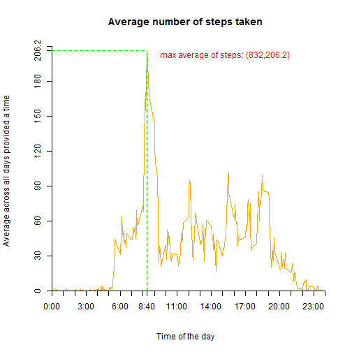
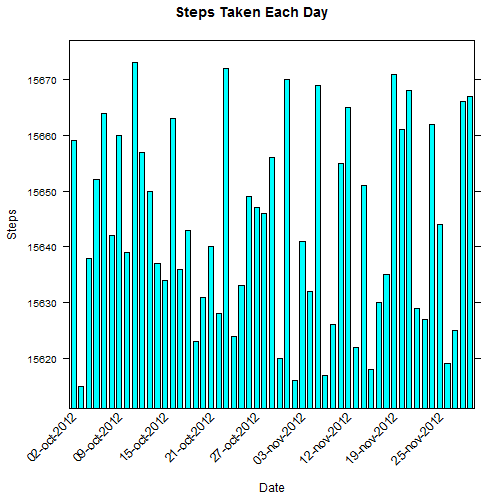
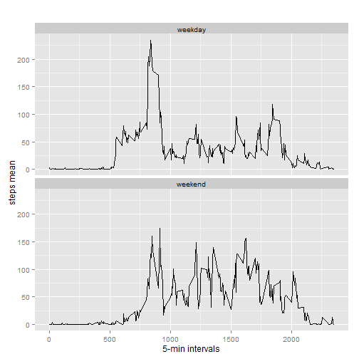

This is an R Programing Assignment 1 using R Markdown. For more details see <https://github.com/garyzava/RepData_PeerAssessment1>.

##1) Loading and preprocessing the data  
Show any code that is needed to  
1.1. Load the data (i.e. read.csv())  
1.2. Process/transform the data (if necessary) into a format suitable for your analysis


```r
setwd("~/DataScience/RepRes-ProgAssig1")
if (!require("plyr")) {
  install.packages("plyr",dependecies=true)
}
if (!require("lattice")) {
  install.packages("lattice",dependecies=true)
}
if (!require("data.table")) {
  install.packages("data.table",dependecies=true)
}
if (!require("httr")) {
  install.packages("httr",dependecies=true)
}
if (!require("ggplot2")) {
  install.packages("ggplot2",dependecies=true)
}
#source("http://bioconductor.org/biocLite.R")
#biocLite("EBImage")
MyData <- paste(getwd(), "/data/activity.csv", sep = "")
activity <- read.table(file =MyData, header = TRUE, sep = ",")
summary(activity)
```

```
##      steps                date          interval     
##  Min.   :  0.00   2012-10-01:  288   Min.   :   0.0  
##  1st Qu.:  0.00   2012-10-02:  288   1st Qu.: 588.8  
##  Median :  0.00   2012-10-03:  288   Median :1177.5  
##  Mean   : 37.38   2012-10-04:  288   Mean   :1177.5  
##  3rd Qu.: 12.00   2012-10-05:  288   3rd Qu.:1766.2  
##  Max.   :806.00   2012-10-06:  288   Max.   :2355.0  
##  NA's   :2304     (Other)   :15840
```

```r
str(activity)
```

```
## 'data.frame':	17568 obs. of  3 variables:
##  $ steps   : int  NA NA NA NA NA NA NA NA NA NA ...
##  $ date    : Factor w/ 61 levels "2012-10-01","2012-10-02",..: 1 1 1 1 1 1 1 1 1 1 ...
##  $ interval: int  0 5 10 15 20 25 30 35 40 45 ...
```

```r
head(activity)
```

```
##   steps       date interval
## 1    NA 2012-10-01        0
## 2    NA 2012-10-01        5
## 3    NA 2012-10-01       10
## 4    NA 2012-10-01       15
## 5    NA 2012-10-01       20
## 6    NA 2012-10-01       25
```

##2) What is mean total number of steps taken per day?  
2.1 Make a histogram of the total number of steps taken each day


```r
activity$dttm <- as.POSIXct(with(activity, paste(date, paste(interval %/% 100, interval %% 100, sep=":"))), format="%Y-%m-%d %H:%M",tz="")
stepsxday <- setNames(aggregate(steps~as.Date(date), activity, sum, na.rm = TRUE), c("date","steps"))
xaxis <- seq(1, nrow(stepsxday), by = 6)
okscale <- list(x = list(rot = 45, cex = 1.0, labels = format(stepsxday$date, "%d-%b-%Y")[xaxis], at = xaxis))
barchart(date ~ steps, data = stepsxday, main = "Steps Taken Each Day", ylab = "steps", xlab = "date", scales = okscale, horizontal = F)
```

 

2.2 Calculate and report the mean and median total number of steps taken per day

```r
paste("mean:", mean(stepsxday$steps))
```

```
## [1] "mean: 10766.1886792453"
```

```r
paste("median:", median(stepsxday$steps))
```

```
## [1] "median: 10765"
```

##3) What is the average daily activity pattern?
3.1 Make a time series plot (i.e. type = "l") of the 5-minute interval (x-axis) and the average number of steps taken, averaged across all days (y-axis)

```r
timeseries <- aggregate(steps ~ interval, data = activity, FUN = mean)
plot(timeseries, type = "l", axes = F, xlab = "Time of the day", ylab = "Average across all days provided a time", main = "Average number of steps taken", col = "orange")
axis(1,at=c(seq(0,2400,100),835), label = paste(c(seq(0,24,1),8),c(rep(":00",25),":40"),sep=""), pos = 0)
axis(2, at=c(seq(0,210,30),206.2), label = c(seq(0,210,30),206.2), pos = 0)
maximum <- which.max(timeseries$steps)
segments(832, 0, 832, 206.2, col = "green", lty = "dashed")
text(835,200, "max average of steps: (832,206.2)", col = "red", adj = c(-.1, -.1))
segments(0, 206.2, 832, 206.2, col = "green", lty = "dashed")
```

 

3.2 Which 5-minute interval, on average across all the days in the dataset, contains the maximum number of steps?

```r
timeseries [maximum, ]
```

```
##     interval    steps
## 104      835 206.1698
```

```r
var <- which.max(timeseries$steps)/12
```

835, is equivalent to 8.6666667, this gives the maximum is reached at 8:40 am

##4) Imputing missing values
4.1 Calculate and report the total number of missing values in the dataset (i.e. the total number of rows with NAs)
```{r
paste("missing observations:", sum(is.na(activity$steps)))
```

4.2 Devise a strategy for filling in all of the missing values in the dataset. The strategy does not need to be sophisticated. For example, you could use the mean/median for that day, or the mean for that 5-minute interval, etc.
4.3 Create a new dataset that is equal to the original dataset but with the missing data filled in.

```r
newdata <- activity
newdata[is.na(activity$steps), ]$steps <- mean(activity$steps)
newdata$dttm <- as.POSIXct(with(newdata, paste(date, paste(interval %/% 100, interval %% 100, sep=":"))),format="%Y-%m-%d %H:%M",tz="")
stepsxday2 <- setNames(aggregate(steps~as.Date(date), newdata, sum, na.rm = TRUE), c("date","steps"))
paste("mean:", mean(stepsxday2$steps))
```

```
## [1] "mean: 10766.1886792453"
```

```r
paste("median:", median(stepsxday2$steps))
```

```
## [1] "median: 10765"
```

```r
paste("means difference:", mean(stepsxday2$steps)-mean(stepsxday$steps))
```

```
## [1] "means difference: 0"
```

```r
paste("medians difference:", median(stepsxday2$steps)-median(stepsxday$steps))
```

```
## [1] "medians difference: 0"
```
4.4 Make a histogram of the total number of steps taken each day and Calculate and report the mean and median total number of steps taken per day. Do these values differ from the estimates from the first part of the assignment? What is the impact of imputing missing data on the estimates of the total daily number of steps?

```r
xaxis <- seq(1, nrow(stepsxday2), by = 6)
okscale2 <- list(x = list(rot = 45, cex = 1.0, labels = format(stepsxday2$date, "%d-%b-%Y")[xaxis], at = xaxis))
barchart(date ~ steps, data = stepsxday2, main = "Steps Taken Each Day", ylab = "Steps", xlab = "Date", scales = okscale2, horizontal = F)
```

 

##5) Are there differences in activity patterns between weekdays and weekends?
5.1 Create a new factor variable in the dataset with two levels -- "weekday" and "weekend" indicating whether a given date is a weekday or weekend day.  
5.2 Make a panel plot containing a time series plot (i.e. type = "l") of the 5-minute interval (x-axis) and the average number of steps taken, averaged across all weekday days or weekend days (y-axis).

```r
str(newdata)
```

```
## 'data.frame':	17568 obs. of  4 variables:
##  $ steps   : num  NA NA NA NA NA NA NA NA NA NA ...
##  $ date    : Factor w/ 61 levels "2012-10-01","2012-10-02",..: 1 1 1 1 1 1 1 1 1 1 ...
##  $ interval: int  0 5 10 15 20 25 30 35 40 45 ...
##  $ dttm    : POSIXct, format: "2012-10-01 00:00:00" "2012-10-01 00:05:00" ...
```

```r
newdata$date <- as.Date(newdata$date, "%Y-%m-%d")
newdata$day <- weekdays(newdata$date)
newdata$daytype <- c("weekday")
for (i in 1:nrow(newdata)){
  if (newdata$day[i] == "sábado" || newdata$day[i] == "domingo"){
    newdata$daytype[i] <- c("weekend")
  }
}
newdata$daytype <- as.factor(newdata$daytype)
weekday_weekend <- aggregate(steps ~ interval+daytype, newdata, mean)
qplot(interval, steps, data=weekday_weekend, geom=c("line"), xlab="5-min intervals", ylab="steps mean", main="") + facet_wrap(~ daytype, ncol=1)
```

 
